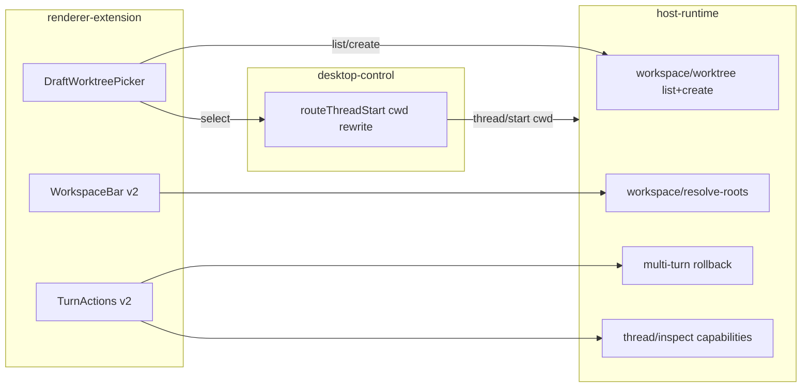

# Plan: 260903 Worktree 三项能力核验与重做

Tool: cursor
Date: 2026-09-03 09:29 (+08:00)
Status: `implemented / partially live-verified`（用户 2026-09-03 10:05 确认按四切片实施；四个切片已于 2026-09-03 完成；11:28 真机量测：状态栏与 hover chip 通过，选择器项目根缺陷已修待重启生效，其余见 [§8 Execution Journal](#8-execution-journal) 的 `[待真机]`）
Documentation level: `standard requirement`（本文件即 owner，保留文件名以维持外部链接；需求原文见 [raw-requirement.md](raw-requirement.md)）

## 0. 基线

- 基线树：`codex-host@czz-dev` `5072d81`（2026-09-03 09:29 测得），工作区仅 `.codemark/codemark.json` 未跟踪。
- 核验方式：静态源码 + OpenSpec + preview + 单测/E2E 对照。**Desktop 未运行**，无真机复现；下文标 `[待真机]` 的判断需实施前用 CDP 量一次。
- 现行权威：[add-composer-workspace-bar](../../../../openspec/changes/add-composer-workspace-bar/specs/renderer-composer-workspace-surface/spec.md)、[1340 task card](../../260902/1340-worktree-checkbox-routing/task-card.md)、[2042 Redo spec](../../260901/2042-external-thread-redo/spec.md)、[preview](../../../../packages/renderer-extension/src/composer-overlay.preview.html)。
- 范围外（本轮不动）：Rust crates、Harness Adapter 协议、文件级回滚（术语表明确 avoid「文件回滚 / 文件快照」）。

## 1. 核验结论：三项都「有骨架、没到位」

### 1.1 新建对话可选 Worktree —— 只是一个勾选框

| 项 | 现状 | 依据 |
| --- | --- | --- |
| 控件 | 单个 `<input type=checkbox>` 「工作树」，插在官方「Switch branch」按钮后 | [renderer-branch-worktree-toggle.ts#L244-L266](../../../../packages/renderer-extension/src/renderer-branch-worktree-toggle.ts) |
| 作用 | 沿 React fiber 找到 Desktop 草稿 owner，调 `setComposerMode("worktree"\|"local")`；Desktop 在提交时自建匿名 worktree | 同文件 `#L42-L81`、`#L202-L232` |
| 选已有 worktree | **没有**。不列 `git worktree list`，不能选 | — |
| 命名 | **没有**。路径/分支由 Desktop 决定，不遵守 `yyMMdd-功能核心` / `codex/<名>` | CodeNote [worktree-tasks.md#L70](../../../../../../CzzProj/CodeNote/AiRef/VibePractice/Vibe_Rules/process/worktree-tasks.md) |
| Host 侧 | 只 inspect（`rev-parse / status / diff --numstat / worktree list --porcelain`），**从不 `worktree add`** | [thread-workspace.ts#L119-L139](../../../../packages/host-runtime/src/thread-workspace.ts) |
| 外部 Harness | `thread/start` 必须带 `cwd`，Host 原样持久化；cwd 来自 Desktop | [app-server-host.ts#L2577-L2612](../../../../packages/host-runtime/src/app-server-host.ts) |
| 可复用的拦截点 | desktop-control 已在 `thread/start` 上改写 `model`（`routeThreadStart`），**同一位置可改写 `cwd` / `runtimeWorkspaceRoots`** | [renderer-draft-prewarm-runtime.ts#L502-L507](../../../../packages/desktop-control/src/renderer-draft-prewarm-runtime.ts)、策略入口 `#L598-L605` |
| 文档漂移 | proposal / tasks 4.2 仍写「默认新建 worktree」，spec 与代码已改默认 Local | [tasks.md#L49](../../../../openspec/changes/add-composer-workspace-bar/tasks.md) |

### 1.2 前几轮回滚 / 编辑 —— UI 承诺的，Host 只兑现一部分

| 项 | 现状 | 依据 |
| --- | --- | --- |
| 触发 | 点轮次（或左侧 8px 圆点）→ `codexhost:turn-files-selected` → 选中轮右上出现 编辑/回滚/Redo | [renderer-turn-actions.ts#L309-L334](../../../../packages/renderer-extension/src/renderer-turn-actions.ts)、[renderer-workspace-bar.ts#L924-L951](../../../../packages/renderer-extension/src/renderer-workspace-bar.ts) |
| 定位 | 挂在 `body` 上的 `position: fixed` 行，靠 `scroll(capture)` / `resize` / MutationObserver **250ms 去抖** 重定位 → 滚动时可见延迟与漂移 | 同文件 `#L663-L681` |
| 回滚 RPC | `thread/rollback { numTurns: 后续轮数 }`；但 Host 对**现存线程只接受 `numTurns=1`**（last-turn），多轮只对「未动过的 Fork 派生线程」生效，否则 `-32076` | [external-thread-rollback.ts#L209-L240](../../../../packages/host-runtime/src/external-thread-rollback.ts)、`#L243+` |
| 「前几轮」 | UI 只要 `laterTurns>0` 就亮回滚 → 选前几轮点确认后 Host 拒绝，**功能实际不可用** | 同上 |
| 编辑 | 无 Host RPC；回滚后 `click()` 官方铅笔按钮（`edit message\|编辑消息`）。Harness 轮次常无该按钮 → 「点了没反应」 | [renderer-turn-actions.ts#L411-L415](../../../../packages/renderer-extension/src/renderer-turn-actions.ts) |
| 文件 | 文案写「尽量还原本轮文件」，实际只 `click()` 官方 Undo；Host/Adapter 不碰文件 | 同文件 `#L393`、`#L139-L142` |
| Redo | 仅 last-turn 且 Native Session ID 变化才有槽；Grok 原地 rewind 永无 Redo | [mapping-store.ts#L534-L543](../../../../packages/mapping-store/src/mapping-store.ts) |
| Cursor / DSH | `rollbackLastTurn: false`，按钮照常出现 | [cursor-models.ts#L73-L78](../../../../packages/adapters/cursor/src/cursor-models.ts)、[deepseek-harness-adapter.ts#L1899](../../../../packages/adapters/deepseek-harness/src/deepseek-harness-adapter.ts) |
| 回滚后 DOM | Desktop 不一定重画 transcript（已知残留） | [2042 changes.md#L88](../../260901/2042-external-thread-redo/changes.md) |
| 规范漂移 | 现行 OpenSpec 仍写「原线程 rollback 应拒绝」，代码已做 last-turn | [external-thread-fork-routing/spec.md#L58-L60](../../../../openspec/specs/external-thread-fork-routing/spec.md) |

### 1.3 底部状态栏 —— 只在「有变更文件」时出现，且只画 inspect 内的仓库

| 项 | 现状 | 依据 |
| --- | --- | --- |
| 出现条件 | 必须收到 `item/fileChange/patchUpdated`；否则整条 `remove()`，**看不到当前 worktree/分支** | [renderer-workspace-bar.ts#L705-L713](../../../../packages/renderer-extension/src/renderer-workspace-bar.ts) |
| 核心环境 | 不区分「线程 cwd 所在 worktree」和「被改到的其他 root」 | `#L349-L367` |
| 跨仓变更 | 绝对路径只匹配 inspect 返回的 primary / submodule / sibling worktree / additional；**CodeNote 这类外部仓的改动被静默丢弃** | 同上 |
| 每 root 统计 | 只有全局聚合 `+/-`；没有每个 root 的文件数与 `+/-`，无法隐藏 0 行 root | `#L369-L380`、`#L735-L744` |
| 定位 | 插在 Composer 前一兄弟 **同时** `position: fixed`。祖先若有 `transform / filter / backdrop-filter`，fixed 会退化为相对该祖先定位 → **整条偏移** `[待真机]`，与用户「偏向中间区域右侧」吻合 | `#L560-L586` |
| 多 chip | `flex-wrap: nowrap; overflow: hidden`，多仓被裁切无 `+N` | `#L78-L85` |
| 悬浮预览 | `min(420px,…)×280px`、`pointer-events: none`、`mouseleave` 立即隐藏、按锚点右侧优先且只夹在 Composer 上沿 → 小、不能滚、可能压住文件列表 | `#L236-L253`、`#L538-L558`、`#L776-L782` |
| 文件列表 | `mergeConversationFiles` 只增不减；revert 后文件不消失 | [renderer-conversation-files.ts#L114](../../../../packages/renderer-extension/src/renderer-conversation-files.ts) |
| 官方控件 | 有替代时隐藏官方 Changes / Review；用户仍看到重叠 `[待真机]`，可能是隐藏选择器漏掉某个 slot 或时序 | `#L418-L457` |
| 死代码 | `worktreeLabel` / `repositoryDisplayName` 有测试但 `renderRow` 不用；worktree 名=分支时显示 `foo · foo` | `#L382-L403`、`#L503-L515` |

## 2. 方案总览

原则：Host 拥有 Git worktree 生命周期（只增不删）；Renderer 不跑 Git；官方 Codex 线程与外部线程走同一 `thread/start` 改写点；所有 UI 承诺必须能被 Host 能力位证明。

### 2.1 方案 A：Host 自管 Worktree 选择器（新建对话）

A-1 契约（`packages/shared-contracts/src/workspace-worktree.ts`，browser-safe zod）

- `codexhost/workspace/worktree/list` `{ projectRoot }` → `{ primaryRoot, worktrees: [{ root, branch, headSha, name, lane, dirty, isPrimary }], suggestedName }`；`suggestedName = yyMMdd-`（GMT+8）。
- `codexhost/workspace/worktree/create` `{ projectRoot, name, lane?: "codex"|"claude"|"cursor"|"group", baseRef? }` → 同一条目。
- 校验：`name` 匹配 `^\d{6}-[a-z0-9][a-z0-9-]{1,40}$`；路径 `{parent}/{RepoName}-worktrees/{lane}/{name}`；分支 `{lane}/{name}`；路径或分支已存在 → `INVALID_ARGUMENT`；**永不删除**。

A-2 Host（`packages/host-runtime/src/workspace-worktree.ts`）

- 复用 `thread-workspace.ts` 的 `git worktree list --porcelain` 解析；新增 `git worktree add -b <branch> <path> <baseRef|HEAD>`。
- 在 [app-server-host.ts#L2013](../../../../packages/host-runtime/src/app-server-host.ts) inspect 旁路由两条新方法；不经官方 app-server。

A-3 desktop-control（[renderer-draft-prewarm-runtime.ts#L502-L507](../../../../packages/desktop-control/src/renderer-draft-prewarm-runtime.ts)）

- 策略对象新增 `selectWorkspace({ cwd, runtimeWorkspaceRoots } | null)`；`routeThreadStart` 在改写 `model` 的同一处改写 `cwd` 与 `runtimeWorkspaceRoots`（`ephemeral` 草稿跳过）。
- `sendDirect` 也使用 `routedParameters`，因此官方 Codex 线程同样进入所选 worktree。
- `thread/started` 后清空选择，避免污染下一个草稿。

A-4 Renderer（`renderer-branch-worktree-toggle.ts` → 重命名 `renderer-draft-worktree-picker.ts`）

- 勾选框改为 chip「工作树 ▾」，菜单：`本地（主目录）` / 已有 worktree 列表（名 · 分支 · dirty 标记）/ `新建…`（输入框预填 `yyMMdd-`，回车创建）。
- 选中任何非本地项时：保持 Desktop `composerMode` 为 `local`（沿用现有 fiber 绑定），并调用 A-3 `selectWorkspace`。
- 偏好键升级 `codexhost.draft-worktree.v1`，只记「上次选择」用于菜单高亮，默认仍是本地。
- 草稿的 `projectRoot` 来源 `[spike]`：优先从同一 React owner 读取 cwd/project 字段；读不到则退回「提交时在 A-3 拦截点用 `params.cwd` 解析并按需创建」（此时「已有 worktree」列表延后到第一次拿到 cwd 后再填充）。

A-5 状态栏联动：新线程首个 `thread/started` 后状态栏立即以 inspect 结果显示该 worktree（依赖 C-2）。

### 2.2 方案 B：轮次回滚 / 编辑

B-1 Host 多轮回滚（[external-thread-rollback.ts#L243+](../../../../packages/host-runtime/src/external-thread-rollback.ts)）

- 对现存线程：当 `numTurns>1` 且保留前缀最后一轮的 `turnMappings` 有 checkpoint、Adapter `fork=true` 时，以该 checkpoint `open({ kind: "fork" })` 生成新 Native Session，走与 last-turn 相同的 `replace` + `historyRedo` 暂存路径。
- Grok：确认 `_x.ai/rewind/execute` 是否接受任意 checkpoint `[spike]`；接受则多轮亦可（无 Redo，同现状）。
- Cursor / DSH：保持拒绝，但要在能力位里说清。

B-2 能力位（`codexhost/thread/inspect` 新增 `rollback: { lastTurn, multiTurn, redo }`）

- Renderer 据此禁用按钮并给出原因 tooltip（如「Cursor 线程不支持回滚」），不再让用户点确认后才被 `-32076` 打回。

B-3 编辑落地

- 回滚（或最后一轮）后：优先官方铅笔；找不到时把选中用户轮的文本回填 Composer（复用 [renderer-composer-prompt-reuse.ts](../../../../packages/renderer-extension/src/renderer-composer-prompt-reuse.ts) 的填充逻辑）并聚焦。
- 文案去掉「还原文件」承诺，改为「不回退文件；如需回退请用官方 Undo / Git」。

B-4 定位与交互

- 去掉左侧 8px 圆点；改为 `[data-turn-key]:hover` 时在轮次右上出现半透明「⋯」chip，点击展开 编辑/回滚/Redo（仍是 Host 自有节点，不写进 React transcript）。
- 重定位改为：滚动容器 `scroll` 同步 + `requestAnimationFrame` 合并；对选中轮加 `ResizeObserver`；MutationObserver 去抖降到一帧。
- 与官方「提交所有的代码变更」相撞时继续 `avoid`（[renderer-overlay-layout.ts#L112](../../../../packages/renderer-extension/src/renderer-overlay-layout.ts) 已有）。

B-5 回滚后刷新 `[spike]`

- 试验 Host 在 replace 成功后向 Desktop 发官方形态的 `thread/…` 通知能否触发重读；不行则 Renderer 在成功后主动 `thread/read` 并提示「已回滚，切换线程可刷新」。

### 2.3 方案 C：底部状态栏

C-1 数据：按 root 分组

- Renderer 把对话文件按 owning root 分组，计算每 root `files / +/-`；`+0/-0` 的 root 不画。
- 落在所有 inspect root 之外的绝对路径 → 新 RPC `codexhost/workspace/resolve-roots { paths[] }`（Host 对每个路径 `git rev-parse --show-toplevel` + 分支 + worktree 判定，缓存按 root）→ 以 `kind: "external"` 加入（例：CodeNote）。

C-2 核心环境常驻

- 只要 inspect 成功，第一枚 chip 固定为线程 cwd 所在 root（primary），带「核心」样式，即使 0 变更；其后按 C-1 只列有变更的 root。
- 「隐藏官方 Changes / Review」的条件不变：仍只在有文件披露时隐藏。

C-3 布局修正

- 条改挂到 `document.body`（与 turn-actions / preview 一致），坐标仍取 `[data-codex-composer-root]` rect → 消除 transformed 祖先导致的 fixed 偏移；实施前先用 CDP 量 bar rect 与 composer rect 差值确认根因 `[待真机]`。
- 多 chip：超出宽度折成 `+N` chip，悬停展开完整列表；不再裁切。
- `renderRow` 用上 `repositoryDisplayName` + `worktreeLabel`，worktree 名与分支相同时只显示一次。
- 对应 OpenSpec「previous sibling」措辞改为「visually floats above the Composer；DOM 位置由 Renderer 决定」（Requirement Change Review）。

C-4 悬浮预览

- 尺寸 `min(560px, 60vw) × min(420px, 50vh)`；定位优先文件列表**左侧**并与列表 rect 不相交；`pointer-events: auto` 可滚动；`mouseleave` 120ms 宽限，鼠标移入预览不关闭；Esc 关闭；顶部显示路径与 `+/-`。

C-5 文件列表收缩

- `mergeConversationFiles` 支持删除：`patchUpdated` 中 `changes` 为空或文件 `+0/-0` 时移出；解析器不再丢弃空 `changes`。

## 3. 切片顺序与规模

1. **切片 1（C-3, C-4, C-1, C-2, C-5）状态栏** —— 只动 renderer-extension + 一条 Host RPC（resolve-roots）+ 对应 spec/preview/E2E。用户可见收益最直接。
2. **切片 2（B-2, B-3, B-4）轮次动作诚实化与定位** —— renderer-extension + inspect 能力位；不改 Adapter。
3. **切片 3（A-1 … A-5）Worktree 选择器** —— shared-contracts + host-runtime + desktop-control + renderer-extension，跨四包，单独 worktree 开发。
4. **切片 4（B-1, B-5）Host 多轮回滚与刷新** —— 风险最高，依赖 spike 结论后再排。

每个切片独立 worktree（`codex/260903-<slice>`）、独立 OpenSpec change 或对现有 change 的 delta，按 CodeNote worktree 生命周期合入 `czz-dev`。

## 4. 验证清单（实施时逐项勾）

- 正常流：新建对话选已有 worktree → `thread/start.cwd` 为该 root；选「新建」→ Host 创建 `{Repo}-worktrees/codex/yyMMdd-x` + 分支 `codex/yyMMdd-x`；状态栏首 chip 为该 worktree。
- 边界 / 空：名字不合法、路径已存在、非 Git 目录、`ephemeral` 草稿、cloud 模式 → 无副作用且有提示。
- 官方 Codex 线程：同样进入所选 worktree；`thread/rollback` 仍原样转发。
- 回滚：Pi/OMP/Claude 多轮回滚生成新 Session 且 Redo 可用；Grok 多轮按 spike 结论；Cursor/DSH 按钮禁用并有原因。
- 编辑：无官方铅笔时 Composer 被回填并聚焦。
- 状态栏：0 变更时只显示核心 chip；跨仓（主目录 + worktree2 + CodeNote）各出现一枚并各带 `+/-`；0 行 root 不出现；revert 后文件从列表消失。
- 布局 `[待真机]`：bar 左缘与 Composer 左缘差 ≤2px；预览不与列表相交；官方 Changes/Review 在替代存在时不可见。
- 回归：现有 `renderer-branch-worktree-toggle` / `renderer-workspace-bar` 单测、Playwright `renderer-composer-workspace-surface`、host-runtime rollback/redo 测试、`npm run typecheck`、`node tools/check-boundaries.mjs`（renderer 仍不得 import Node builtins）。
- 并发 / 重复提交：连续两次点「新建」只创建一次；创建期间禁用提交。

## 5. 非目标（本方案明确不做）

- 删除 / 清理 worktree、切换现存线程的 cwd、迁移 Harness。
- 文件级回滚或快照（保持术语表 avoid）。
- 劫持 Desktop `codex-worktrees` IPC 或改 Desktop 自身的 worktree 命名。
- Rust 侧改动。
- 官方 Codex 线程的 Host Redo。

## 6. 风险与开放问题

- `[spike]` 草稿阶段能否拿到 projectRoot（A-4）；拿不到则「已有 worktree」列表体验降级。
- `[spike]` Grok rewind 多轮能力（B-1）。
- `[spike]` 回滚后 Desktop transcript 刷新（B-5）。
- `[待真机]` 状态栏偏移根因是否为 transformed 祖先；若不是，改挂 body 仍是正确方向但需另找偏移源。
- Desktop 升级可能改动 `run-location` / `data-composer-navigation-target` / `[data-review-path]` 等私有 DOM；沿用 fail-closed 策略，并在 [codexhost-update-impact-audit](../../../../.agents/skills/codexhost-update-impact-audit/SKILL.md) 里登记新依赖点。

## 7. 文档影响

- 本文件：确认后升级为 `spec.md`（Standard requirement owner），补 Requirement Change Review、Verification Impact Trace、Execution Journal。
- OpenSpec：`add-composer-workspace-bar` 追加 delta（C-2/C-3 措辞、A 的选择器替代勾选框）；新建 `add-host-managed-worktree-selection` 与 `add-external-thread-multi-turn-rollback` 两个 change；修正 `external-thread-fork-routing` 「原线程 rollback 应拒绝」的漂移。
- preview：`composer-overlay.preview.html` 增加「工作树 ▾」菜单、核心 chip、`+N`、大预览、hover「⋯」四个状态。
- 术语表：新增「核心工作区 / 涉及仓库」两条。
- 过程枢纽：[PROJECT_STATUS.md](../../PROJECT_STATUS.md) 已登记本任务。

## 8. Execution Journal

实施在 `czz-dev` 控制检出上直接进行（用户要求一次做完四个切片、不间断；未按 §3 每切片开独立 worktree，改为每切片一次提交以保持可独立回退）。

### 切片 1 状态栏 — 2026-09-03 done

- 实现偏差（Requirement Change Review）：C-1 的「新 RPC `codexhost/workspace/resolve-roots`」改为扩展现有 `codexhost/thread/workspace/inspect` 参数 `extraPaths[]`，Host 把每个绝对路径的最近存在祖先目录 `rev-parse --show-toplevel` 后以 `kind: "external"` 追加。理由：复用同一 inspect 管线与 watch 登记，Renderer 无需第二条订阅；语义与原方案一致。
- 代码：`packages/shared-contracts/src/thread-workspace.ts`（`external` kind、`extraPaths`）；`packages/host-runtime/src/thread-workspace.ts`（`nearestDirectory`、`inspectGitWorkspace(cwd, extraRoots, extraPaths)`）；`packages/host-runtime/src/app-server-host.ts#inspectThreadWorkspace` 透传；`packages/renderer-extension/src/renderer-conversation-files.ts`（`itemId`、空变更集可投递、`conversationFilesFromItems`）；`packages/renderer-extension/src/renderer-workspace-bar.ts` 重写（挂 body、核心 chip、按 root 分组、`+N`、大预览、Item 级文件集）。
- 验证（Verification Impact Trace）：`npm run typecheck` 通过；`vitest` shared-contracts/host-runtime/renderer-extension workspace 相关 18 例通过，renderer-extension 全量 228 例通过；Playwright `tests/e2e/renderer-composer-workspace-surface.spec.ts` 通过（新增核心 chip 先于文件、body 挂载与 Composer 对齐、预览不与列表相交且可进入、Esc 关闭、`external` chip 与 `extraPaths` 透传、0 行 root 无 chip、revert 收缩五组断言）；`eslint` 与 `node tools/check-boundaries.mjs` 通过。
- `[待真机]` 仍未量：bar 左缘与 Composer 左缘差、预览在真实 Desktop 中的位置；Desktop 未运行。
- 文档：OpenSpec `add-composer-workspace-bar` 两个 spec delta 与 tasks §11 已更新；preview HTML 已更新核心 chip / external / `+N` / 大预览。

### 切片 2 轮次动作诚实化与定位 — 2026-09-03 done

- 契约：`externalThreadInspectionSchema` 新增可选 `rollback: { lastTurn, multiTurn }`（`packages/shared-contracts/src/harness-models.ts`）；Host 由 `externalRollbackCapabilities()`（`packages/host-runtime/src/external-thread-rollback.ts`）计算：`lastTurn = turns>0 && (history.rollbackLastTurn || 未动过的 Fork 派生线程)`，`multiTurn = turns>1 && Fork 派生`。切片 4 将把 checkpoint fork 纳入 `multiTurn`。
- Renderer（`packages/renderer-extension/src/renderer-turn-actions.ts` 重写）：`rollbackSupportFor()` 把能力位折成 `full | lastTurnOnly | none`；回滚按钮按之禁用并给原因 tooltip；编辑只在真会回滚时二次确认；编辑优先官方铅笔，找不到时 `turnPromptText()` 读本轮提示 → `clearComposerEditor` + `insertComposerText` 回填并聚焦；文案去掉「还原文件」，`runRollback` 不再暗点官方 Undo；左侧 8px 圆点删除，改为单个 hover「⋯」chip（`data-codexhost-turn-hover`）锚在悬停轮次右上、避让官方 chrome、离开 160ms 宽限；scroll/resize/mutation/ResizeObserver 统一 `requestAnimationFrame` 合并重定位。
- 偏差：B-4 原文「点击「⋯」展开菜单」实现为「点击即选中该轮并显示既有动作簇」，少一层菜单；原因是动作簇已是横向 chip 且带确认，不需要第二层。
- 验证：`npm run typecheck` 通过；renderer-extension + shared-contracts 322 例通过；host-runtime `app-server-host.test.ts` inspect/rollback/redo 10 例通过（inspect 断言新增 `rollback` 位）；Playwright `renderer-composer-workspace-surface` 通过（新增 hover chip 位置、点击选中、Edit 回填 Composer 与通知三组断言）。
- 文档：新建 OpenSpec change `add-external-thread-multi-turn-rollback`（proposal / tasks §1–§2 勾选、§3 留给切片 4 / `external-thread-fork-routing` delta）；`add-composer-workspace-bar` renderer spec 新增「Turn actions」Requirement；preview HTML 更新。`openspec` CLI 未安装，未做 strict validate。

### 切片 3 Worktree 选择器 — 2026-09-03 done

- 契约（A-1）：`packages/shared-contracts/src/workspace-worktree.ts` 新增 `codexhost/workspace/worktree/list|create`、名称正则 `^\d{6}-[a-z0-9][a-z0-9-]{1,40}$`、lane 枚举 `codex|claude|cursor|group`、条目 `{ root, name, branch, headSha, lane, dirty, isPrimary }`、`suggestedWorkspaceWorktreeName()`（GMT+8 `yyMMdd-`）。
- Host（A-2）：`packages/host-runtime/src/workspace-worktree.ts`：`resolvePrimaryRoot()` 通过 `--git-common-dir` 从任意成员目录回到主检出；`listWorkspaceWorktrees()` 解析 `git worktree list --porcelain` 并逐个取 `status --porcelain` 得 dirty；`createWorkspaceWorktree()` 校验名称 / 路径不存在 / 分支不存在 / `baseRef` 可解析后 `git worktree add -b {lane}/{name} {parent}/{Repo}-worktrees/{lane}/{name} {baseRef|HEAD}`，任何失败 `-32602`/`-32603` 且不动仓库；`AppServerHost` 两条路由不经官方 app-server。
- desktop-control（A-3）：策略对象新增 `selectWorkspace({ cwd } | null)` 与 `draftCwd()`；`routeThreadStart` 在改写 `model` 的同一处改写 `cwd` 并把 `runtimeWorkspaceRoots` 中等于原 cwd 的项替换，`ephemeral` 跳过，`sendDirect` 同样吃改写后的参数，因此官方 Codex 线程同路；切换选择时 `discardAllPrewarmedThreads()`，避免旧 cwd 的预热线程接首轮。**偏差**：原文「`thread/started` 后清空选择」改为「Renderer 在草稿结束（run-location 所有权消失 / 提交）时调用 `selectWorkspace(null)`」，因为 prewarm 与真正提交都走 `thread/start`，Host 侧无法区分，按通知清空会误伤重新预热。
- Renderer（A-4）：`renderer-branch-worktree-toggle.ts` 删除，改为 `renderer-draft-worktree-picker.ts`：「工作树 · 本地 ▾」chip 挂在 Switch-branch 旁；菜单 = 本地 / 临时工作树（Desktop 匿名 worktree，保留原勾选框能力）/ 已有 Host 工作树（名 · 分支 · 未提交标记，主检出不重复列出）/ 新建…（预填 `yyMMdd-`，本地正则先拦，Host 错误内联显示，创建期间禁用提交）。选 Host 工作树时保持 `composerMode=local` 并 `selectWorkspace({cwd})`；偏好键 `codexhost.draft-worktree.v1` 只存上次选择用于「上次」标记，新草稿一律本地；旧键 `.v2` 只读一次映射为「临时工作树」的上次标记。
- projectRoot spike（A-4 `[spike]`）结论：静态无法确认 Desktop React owner 是否暴露 cwd；实现为双源——先在 run-location 同一 fiber 链上找 `cwd|projectRoot|projectPath|workspaceRoot|workspacePath|rootPath|directory` 或 `project.path` 等绝对路径，找不到则用策略 `draftCwd()`（Desktop 自己预热 `thread/start` 时带的 cwd，desktop-control 观察并经 `codexhost:draft-workspace-changed` 通知）。两者都没有时菜单提示「先选择项目」，新建禁用。tasks §12.6 留真机确认。
- A-5：状态栏在新线程 `thread/started` 后走既有 inspect 管线显示所选 worktree（切片 1 的核心 chip），未另加代码。
- 验证：`tsc -b` 与 `tests/tsconfig.json` 通过；vitest 全量 189 文件 / 1640 例通过（新增 `workspace-worktree.test.ts` 4 例：主检出列表与建议名、创建路径/分支/lane 与从子 worktree 反解主根、非法名/重复路径/重复分支/未知 baseRef 拒绝且不删、非 Git 拒绝；desktop-control 新增 cwd 改写 1 例；picker 助手 7 例；`renderer-model-client` 方法清单更新；`app-server-host` 新增两条路由的 `-32602` 断言）；Playwright `renderer-composer-workspace-surface` 通过（新增列表拉取、选已有、临时工作树、新建三态、草稿结束释放与下个草稿「上次」标记）；`eslint` 与 `node tools/check-boundaries.mjs` 通过。
- 文档：OpenSpec `add-composer-workspace-bar` renderer spec 的勾选框 Requirement 改写为「Draft worktree picker」，`thread-workspace-inspection` 新增「Host lists and creates project worktrees」Requirement，proposal 与 tasks §12 更新（未另建 `add-host-managed-worktree-selection`，因为改动都落在同一 change 的两个 capability 内）；preview HTML 更新。

### 切片 4 Host 多轮回滚与刷新 — 2026-09-03 done（真机项待验）

- spike（B-1）结论：Pi / OMP / Grok / DeepSeek Harness / Claude Code 五个 Adapter 均 `history.fork: true`、每轮产出 `nativeCheckpointRef`，且 `open({ kind: "fork", sourceRef, checkpoint })` 可对自己的 Session 使用（Grok 走 ACP fork/rewind 传输）；Pi / OMP / Grok / Claude 另有 `rollbackLastTurn`，`numTurns=1` 仍优先走原生回滚；DeepSeek Harness 无 `rollbackLastTurn`，所有回滚都走 checkpoint fork；Cursor `fork: false`，能力位保持 `none`。各 Harness 真机确认见 OpenSpec tasks §3.6。
- Host（`packages/host-runtime/src/external-thread-rollback.ts`）：`executeExternalThreadRollback` 改为三段——`numTurns=1 && rollbackLastTurn` → 原生 last-turn；未动过的 Fork 派生前缀 → 原 fork-source 路径（抽为 `executeForkSourceRollback`，不适用时返回 `null` 而非报错）；其余 → 新增 `executeCheckpointRollback`：对线程自己的 Native Session 在「保留的最后一轮」checkpoint 处 fork，要求得到不同的 Session、轮数恰等于保留数、transport 配置不变，然后 `repository.commitCheckpointRollback` 持久化并 `runtime.replace`。始终保留第一轮：`numTurns >= turns` 先以 `-32076` 拒绝，不开 Session；边界无 checkpoint `-32080`。`externalRollbackCapabilities` 把「自身 checkpoint 可 fork」并入 `lastTurn` / `multiTurn`。
- mapping-store：`replaceReadySessionAfterRollback`（任意尾部长度）与原 `replaceReadySessionAfterLastTurn`（恰少一轮）共用 `#replaceReadySessionAfterRollback`，都把旧 Session + 完整轮次列表存进唯一 Redo 槽；`historyRedo` 校验从「恰多一轮」放宽为「严格多于当前前缀」。`ExternalThreadRepository.commitCheckpointRollback` 校验 Session 不同、`1 <= 保留 < 全部`、Snapshot 身份后写入。
- B-5 transcript 刷新：Desktop 分页 transcript 只在 `thread/reverted` 后重读（官方 Revert 路径），Renderer 发起的 `thread/rollback` 与 Host Redo 是在 Desktop 背后换历史，因此 Host 对 `historyMode: "paginated"` 的外部线程在回滚 / Redo 成功后补发 `thread/reverted { threadId }`；legacy 模式沿用响应结果更新，不发通知。Renderer `runRollback` 后 `redoAvailable = true`（任何回滚长度都有 Redo 槽，后续 inspect 为准），Redo 文案去掉「最后一轮」。
- 验证：`tsc -b` 通过；vitest host-runtime + mapping-store + renderer-extension 63 文件 / 588 例通过（新增 mapping-store「多轮 checkpoint 回滚入同一 Redo 槽并整体恢复」1 例；`app-server-host` 原「非未动过派生前缀则拒绝」用例改写为「现存线程在自身 checkpoint 回滚、公布能力位、提供 Redo」：inspect `{lastTurn:true,multiTurn:true}`、`numTurns=3` 拒绝且不开 Session、`numTurns=2` 保留首轮并 stash 三轮、越过 Fork 边界的派生线程按自身 lineage 回滚、Redo 恢复三轮、`thread/reverted` 按线程各发一次）；Playwright `renderer-composer-workspace-surface` 通过；`eslint` 通过。
- `[待真机]`：Desktop 分页 transcript 是否真的在 `thread/reverted` 后重读；legacy 模式线程下一次 `thread/read` 后是否显示缩短的对话；每个 Harness 对自身 Session 的 checkpoint fork 是否与 fake adapter 行为一致。
- 文档：OpenSpec `add-external-thread-multi-turn-rollback` proposal / tasks §3 / `external-thread-fork-routing` delta 新增「Host rolls a live External Thread back at its own Checkpoint」与「History replacement notifies paginated Desktop transcripts」两条 Requirement；本文件 Status 升为 `implemented / live-verification pending`。
- 预览页分享（2026-09-03 11:09）：`composer-overlay.preview.html` 已作为「追踪文件」登记进 czzLocalShare（端口 8789，直读原路径、改了即时同步），追踪别名与本地显示名均为「codexhost预览」；本机链接 `http://127.0.0.1:8789/p/nLzclnQ6/composer-overlay.preview.html`。
- 预览页交互核验（2026-09-03 11:12，ego-browser 任务空间 2，1440×900）：发现并修正 6 处——模拟窗口随说明栏拉高到 1455px 使 Composer/bar 掉出首屏（`.stage` 改 sticky + `100vh`）；「工作树」菜单常开且 z-index 20 盖住 bar 右 2/3，文件披露与 diff 预览点不到（改为默认收起、点 chip 切换、Esc/点外关闭、选项可选）；回滚/编辑文案仍承诺「还原文件」（对齐 `turnActionCopy`）；缺 hover「⋯」chip 与能力位禁用演示（补 `.turn-hover`，t1 演示 `lastTurnOnly` 禁用 + 编辑回填 toast）；diff 预览左溢出模拟窗口 100px（按窗口左缘 clamp 宽度）；核心 chip 文本压到 CodeNote chip 上（核心 chip 收缩省略，其余 `flex: none`）。修正后量测：预览与列表不相交且在窗口内，chip 无重叠，菜单在 chip 上方且 Esc 关闭。`[待真机]` 项不变。

### 真机量测（2026-09-03 11:28–11:45，源码 Desktop）
- 启动：`codexhost inspect` 确认 Desktop 未运行后 `npm run build` + `codexhost launch`；Desktop PID 11131、Launcher 11129、Host runtime `packages/host-runtime/dist/main.js` PID 11283，runtime descriptor `~/Library/Application Support/codexhost/desktop-runtime-v1.json` 权限 `0600`。量测走 Electron 主进程 Inspector（`CODEXHOST_CONTROL_PORT` 旁的 56286）→ `webContents.executeJavaScript`，只读 DOM / React fiber，脚本在 `/tmp`，未进仓。
- 状态栏（切片 1）`[真机通过]`：线程视图下 bar `position: fixed`、父节点 `BODY`，rect `x=846 w=736`，Composer root rect `x=846 w=736`——左缘差 **0px**（要求 ≤2px），bar 底 829 与 Composer 顶 837 间距 8px；核心 chip 常驻「codex-host · czz-dev」，1 行。草稿视图（无线程）不渲染 bar。旧「偏移」根因即 transformed 祖先下的 fixed 退化，改挂 body 后消失。
- hover「⋯」chip（切片 2）`[真机通过]`：对 `[data-turn-key]`（rect `y=77 h=1334`，滚动容器 `0..1050`，Composer 顶 837）派发 `mouseover` 后 chip 同步落到 `(1548, 85)` = 轮次右上内缩 8px，`data-visible=true`；`mouseout` 160ms 后隐藏。用户真实鼠标在别处移动时会按预期把它收回，因此异步量测前两次读到隐藏属正常。多轮回滚 / `thread/reverted` 重读仍需一条外部线程配合，未在用户线程上操作，保持 `[待真机]`。
- 「Worktree ▾」选择器（切片 3）`[真机缺陷 → 已修]`：chip 挂在 Switch-branch 旁（rect `x=1164 y=906 w=122 h=22`），点开菜单 `z-index 2147483000`、位于 chip 上方 (`y=750 h=150`)、Esc 可关；但**刚启动未发过消息时**「Existing worktrees」显示「Pick a project to list worktrees」、「New worktree…」禁用——`binding.projectRoot` 为 null 且 `draftCwd()` 为 null（后者只在首次 `thread/start` 后才有值）。深扫 run-location 按钮 fiber 链（共 215 层）：绝对路径出现在第 26 层 `executionTargetOverride.cwd / .activeWorkspaceRoot` 与第 40 层 `gitRootForStartingState / worktreeEnvironmentWorkspaceRoot / localRemoteExecutionTarget.cwd`，都在 `FIBER_DEPTH_LIMIT=60` 内，只是键名不在 `PATH_PROP_KEYS`。修复：`renderer-draft-worktree-picker.ts` 的 `PATH_PROP_KEYS` 增加 `gitRootForStartingState`、`worktreeEnvironmentWorkspaceRoot`，嵌套键增加 `executionTargetOverride`、`localRemoteExecutionTarget` 与子键 `activeWorkspaceRoot`；单测补三种真机形状。已 `npm run build`，但 desktop-controller 在启动时一次性读入 Renderer 源（`production-controller.ts` `readRenderer`），运行中的 Desktop 不会热替换——需按 [czz-dev.md](../../../../docs/czz-dev.md) 的正常退出 + `codexhost launch` 门禁重启后再点开菜单确认列出 `codex/260902-worktree-checkbox-routing` 与 `claude/cursor-multi-agent-codex-5be354` 两个 linked worktree。
- 观察（非缺陷）：官方 run-location 控件「Work locally / Local」与 Host「Worktree · Local ▾」并排；spec 里的「代替勾选框」指旧 Host 勾选框，官方控件保留。若嫌重复可后续考虑隐藏官方控件，属产品决定。
- 量测期间为读取草稿 props 用侧栏「Start new chat in codex-host」打开过一个空草稿（未发消息、未创建线程），用户原线程（`8e799f59-…`）仍在后台运行，需手动点回。

### 用户截图复核（2026-09-03 11:46，线程「260902-Rust常用crate清单」）
- 现象 1：动作簇 Edit / Rollback / Redo 压在用户提示词正文上，chip 底色 88% 半透明、禁用态 `opacity .38`，正文从按钮里透出来（「tence description」可见）；同时 Desktop 原生「编辑消息」模式（Cancel / Send）已打开，Host 动作簇与之重复。
- 现象 2：状态栏浮在 transcript 上方，Desktop 只为自己的 Composer 容器预留底部空间（量得 213px），bar 的 34+8px 没有预留——滚到底时最后两行被 bar 盖住；「0 files this turn +0 -0」计数是噪音。
- 真机结构（只读量测）：`.thread-scroll-container` 为 `flex column-reverse`，首子元素是内容列（`min-h-full`），Composer 容器 `absolute bottom-0` 213px；轮次 `x=846..1582`，滚动容器 `x=276..2151`，右侧空白槽 569px。用户气泡 `oklab(… / 0.05)` 半透明圆角 25px、正文横跨整行，右上角必然是正文。
- 修正（本次提交）：
  - `renderer-overlay-layout.ts`：`turnActionOrigin` 新增 `gutterRight` 候选——轮次右侧空白槽放得下（`turn.right + 8 + width + 8 ≤ min(scroller.right, viewport)`）时动作簇与 hover「⋯」落在轮次右侧、顶对齐；放不下退回轮次右上角。`turnActionPlacement` 的 `scroller` 接受 `right`。`.codexhost-overlay-chip` 底色改不透明 `rgb(24 24 24)`，hover / active 用实色，禁用态改「压暗文字与边框」而非整体透明。
  - `renderer-turn-actions.ts`：新增 `turnInNativeEdit()`（轮次内出现 `textarea` / `contenteditable`），原生编辑模式下动作簇与「⋯」都隐藏；hover chip 底色改实色。
  - `renderer-workspace-bar.ts`：`placeBar` 后 `reserveTranscriptSpace()` 给滚动容器首子元素加 `padding-bottom = composer.top − bar.top`（本机 42px），bar 移除 / 空态时释放；文件计数在 `+0 / -0` 时不再渲染统计。
  - OpenSpec renderer spec「hover ⋯」Requirement 改为「右侧空白槽优先，放不下退回右上；实色底面；原生编辑模式隐藏」；preview 页 chip 改实色、hover「⋯」示意到轮次右侧。
- 验证：`typecheck` 通过；renderer-extension vitest 65 文件 463 例通过（`turnActionPlacement` 新增空白槽命中 / 太窄回退两例）；Playwright `renderer-composer-workspace-surface` 通过。**真机仍需重启后看**：desktop-controller 只在启动时读一次 Renderer 源，运行中的 Desktop 不会拿到这批改动。
